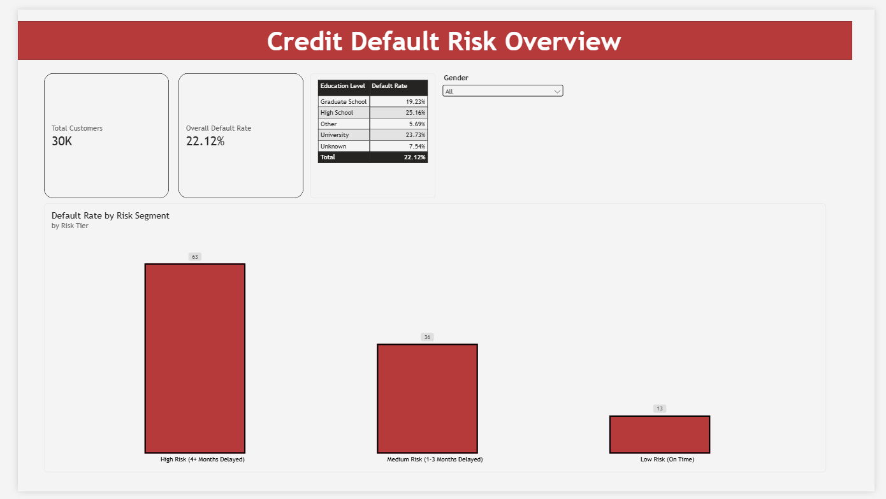

# Credit Default Risk Analysis

## Project Overview
Built an end-to-end data pipeline to analyze historical payment behaviors and predict credit card default risk. This project identifies high-risk customer segments to help financial institutions mitigate potential revenue loss.

## Tech Stack
* **Python (pandas, SQLAlchemy):** Automated the extraction of raw Kaggle data, cleaned column structures, and loaded records into a relational database.
* **MySQL:** Engineered views and wrote complex analytical queries using CTEs to segment 30,000 customers into distinct risk tiers based on rolling payment delays.
* **Power BI:** Built an interactive executive dashboard to visualize risk distribution and demographic metrics.

## Key Business Insights
* **Delayed Payments are Critical Indicators:** Customers with 4+ months of delayed payments have a 63% default rate, drastically higher than the 22.12% overall portfolio average.
* **Demographic Trends:** Highschool Graduates has the highest default rate with 25%, followed by University at 23%, then Graduate School at 19%.

## Executive Dashboard

## How to Run Locally
1. Clone the repository.
2. Create a virtual environment and run `pip install -r requirements.txt`.
3. Download the raw dataset from Kaggle and place it in `data/raw/`.
4. Create a `.env` file with your MySQL credentials (`DB_HOST`, `DB_USER`, `DB_PASSWORD`, `DB_NAME`).
5. Run `python src/ingest_data.py` to execute the ETL pipeline and populate the database.